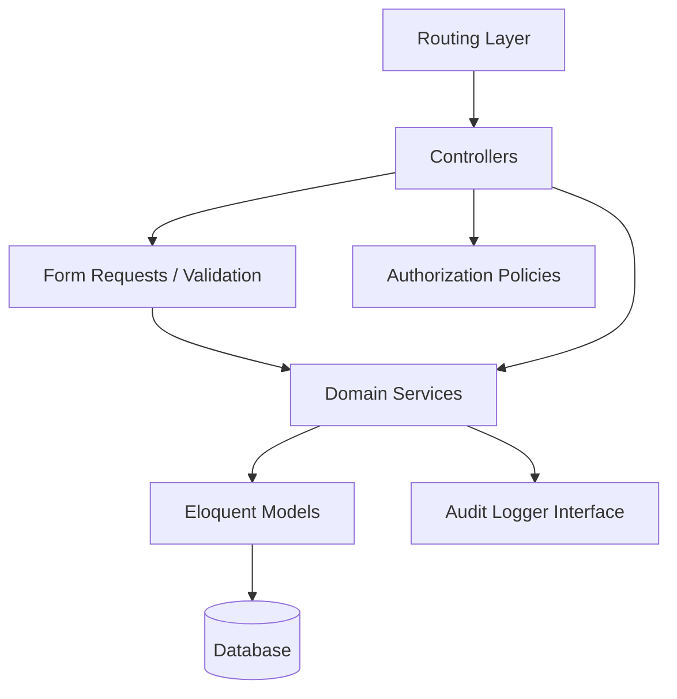
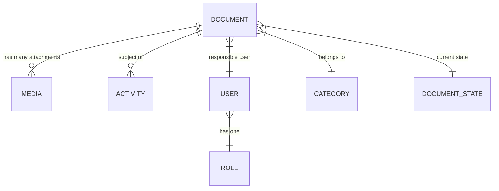
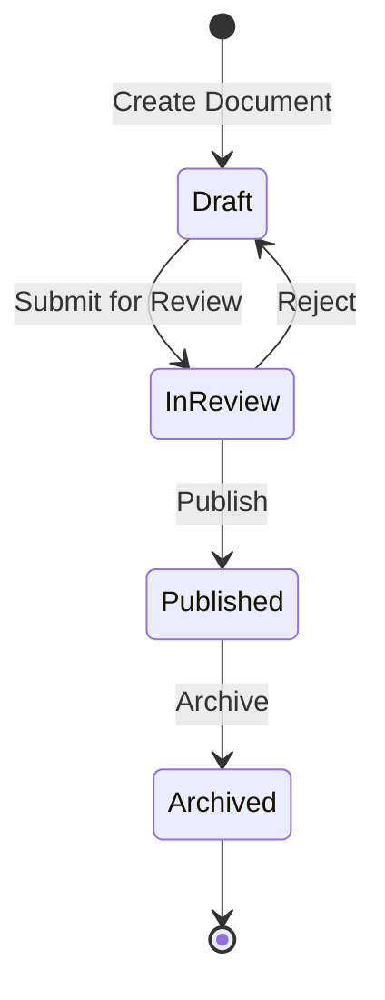
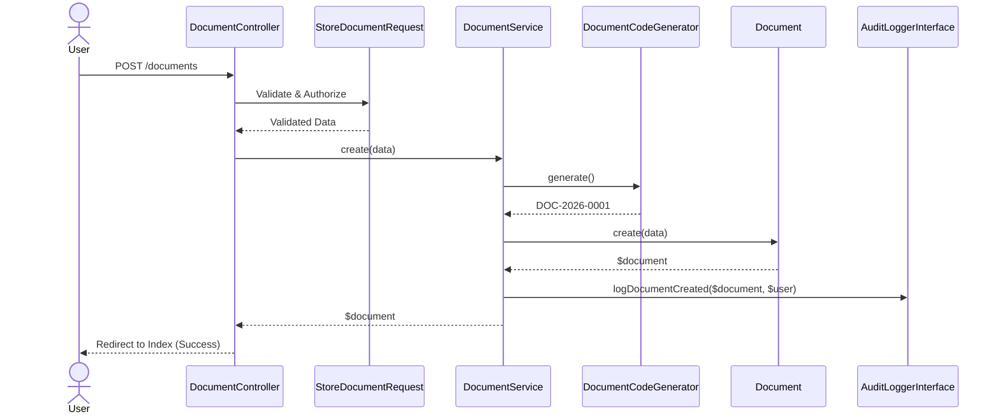

# Document Management System (SGD)

A robust, enterprise-ready Document Management System (Sistema de Gestão de Documentos - SGD) built with Laravel. This application provides secure document storage, workflow enforcement, comprehensive auditing, and an operational dashboard for organization-wide document governance.

## Key Features

- **Domain-Driven Workflows:** Documents progress through strict lifecycle states (Draft &rarr; In Review &rarr; Published &rarr; Archived) enforced by a dedicated `DocumentWorkflowService`.
- **Role-Based Access Control:** Distinct roles (Operator, Administrator) are managed via robust Laravel Policies.
- **Secure Attachments:** File attachments are stored securely on a private disk using `spatie/laravel-medialibrary`, preventing unauthorized direct access.
- **Comprehensive Audit Trail:** All critical business events (creation, updates, uploads, workflow transitions) are tracked via an encapsulated audit layer backed by `spatie/laravel-activitylog`.
- **Operational Dashboard:** An at-a-glance dashboard surfacing document metrics, state distribution, and a human-readable recent activity timeline.
- **Advanced Search & Filtering:** Find documents rapidly by exact code matching, wildcard titles, category, or workflow state.

## Technology Stack

- **Backend:** Laravel 11.x, PHP 8.3
- **Database:** MySQL 8.x
- **Frontend:** Laravel Blade, Tailwind CSS, Alpine.js (used minimally for basic UI interactions)
- **File Management:** Spatie Media Library
- **Audit Logging:** Spatie Activitylog
- **Testing:** Pest PHP
- **Deployment & Development:** Laravel Sail (Docker)

## Architecture

SGD strictly adheres to a layered architecture to maintain clear separation of concerns, ensuring long-term maintainability.

### Layered Architecture



### Domain Model



### Document Workflow (Lifecycle)



### Document Creation Sequence



For more detailed architectural rules and decisions, refer to the [Documentation](docs/).

## Project Structure

- `app/Contracts/`: Strict interfaces (e.g., `AuditLoggerInterface`) shielding the application from third-party coupling.
- `app/Enums/`: Domain-specific enumerations (Roles, Document States, Priorities) for type safety.
- `app/Services/`: Core business logic and workflow orchestration (`DocumentService`, `DocumentWorkflowService`, `DashboardService`).
- `app/Models/`: Thin Eloquent models focused exclusively on data relationships and accessors.
- `app/Http/Controllers/`: Thin controllers responsible solely for HTTP orchestration.
- `docs/`: Comprehensive project documentation, RFCs, roadmap, and definition of done.

## Installation and Deployment

SGD is configured to run effortlessly in a local development environment using Laravel Sail (Docker).

1. **Clone the repository:**
   ```bash
   git clone <repository-url> sgd
   cd sgd
   ```

2. **Install Composer Dependencies:**
   ```bash
   docker run --rm \
       -u "$(id -u):$(id -g)" \
       -v "$(pwd):/var/www/html" \
       -w /var/www/html \
       laravelsail/php83-composer:latest \
       composer install --ignore-platform-reqs
   ```

3. **Configure Environment:**
   ```bash
   cp .env.example .env
   ```
   *(Ensure `DB_CONNECTION=mysql` and standard Sail credentials are used).*

4. **Start the Docker Containers:**
   ```bash
   ./vendor/bin/sail up -d
   ```

5. **Run Setup Commands:**
   ```bash
   ./vendor/bin/sail artisan key:generate
   ./vendor/bin/sail artisan migrate --seed
   ./vendor/bin/sail npm install
   ./vendor/bin/sail npm run build
   ```

6. **Access the Application:**
   Visit `http://localhost` in your browser. Use the seeded credentials to log in.

## License

This project is open-sourced software licensed under the [MIT license](LICENSE).
